  

<h2 align="center">Shobhit Yadav</h2>

  Student • Web Developer • Frontend Learner

  Exploring technology, building for the web, and turning ideas into code.

### Knowledge
- Complete Science
- IT Tools & Networking
- Web Designing
- Frontend Development
- Cyber Security & Ethical Hacking

### Technologies
HTML • CSS • JavaScript • Git • GitHub • Linux • Python

### GitHub
- GitHub: [@Shobhityadav82](https://github.com/Shobhityadav82)
<!--
**shobhityadav82/shobhityadav82** is a ✨ _special_ ✨ repository because its `README.md` (this file) appears on your GitHub profile.

Here are some ideas to get you started:

- 🔭 I’m currently working on ...
- 🌱 I’m currently learning ...
- 👯 I’m looking to collaborate on ...
- 🤔 I’m looking for help with ...
- 💬 Ask me about ...
- 📫 How to reach me: ...
- 😄 Pronouns: ...
- ⚡ Fun fact: ...
-->
